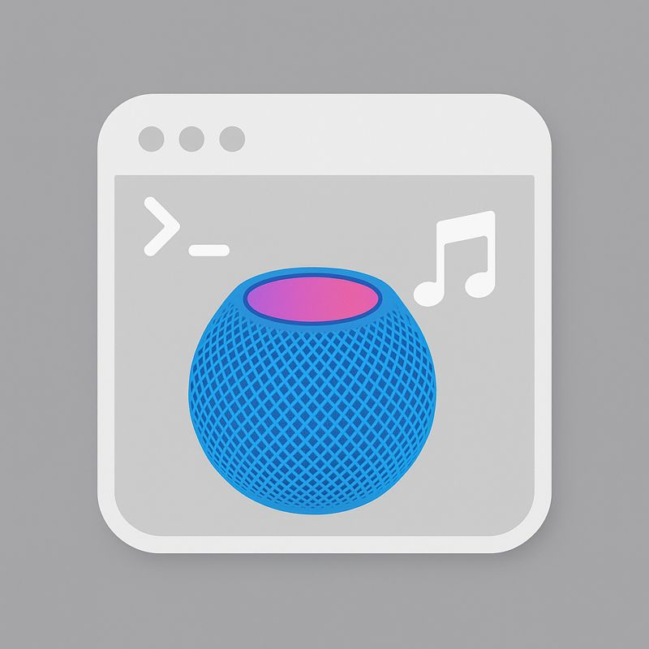

# homepodctl

<p align="center">
  
</p>

<p align="center">
  <a href="https://github.com/agisilaos/homepodctl/releases">
    
  </a>
  
  
</p>

macOS CLI that controls Apple Music playback and routes audio to HomePods.

## Requirements

- macOS with the Music app
- `osascript` (built-in)
- `shortcuts` (built-in, optional for the `native` backend)
- Go toolchain to build

## Permissions

On first use, macOS may prompt you to allow your terminal (or the built binary) to control:

- Music (via Apple Events)
- Shortcuts (if you use the `native` backend)

## Two playback backends

- `--backend airplay`: selects Music.app AirPlay output device(s) and plays a playlist (the Mac is the sender).
- `--backend native`: runs a Shortcuts automation you map in `config.json` (can be set up so HomePod plays natively).

## Quick start

List available HomePods (AirPlay devices):

```sh
homepodctl devices
```

Search playlists:

```sh
homepodctl playlists --query chill
```

See what’s playing (track/album/playlist + outputs):

```sh
homepodctl status
```

Watch changes:

```sh
homepodctl status --watch 1s
```

Play a playlist to a specific HomePod (AirPlay from Mac):

```sh
homepodctl play --backend airplay --room "Bedroom" --playlist "Example Playlist" --volume 35
```

If multiple playlists match, pick interactively:

```sh
homepodctl play --backend airplay --room "Bedroom" --playlist "Autumn" --choose
```

If a playlist name is ambiguous or tricky to match (emoji/whitespace), use IDs:

```sh
homepodctl playlists --query autumn
homepodctl play --backend airplay --room "Bedroom" --playlist-id <PERSISTENT_ID>
```

Initialize config for native mode:

```sh
homepodctl config-init
```

Then edit the file printed by `config-init` and map `room -> playlist -> shortcut name`, and run:

```sh
homepodctl play --backend native --room "Bedroom" --playlist "Example Playlist"
```

Run an alias from your config:

```sh
homepodctl run bed-example
```

List aliases:

```sh
homepodctl aliases
```

## Distribution

This tool is macOS-only (it relies on `osascript` + Music.app, and optionally `shortcuts`).

- **Homebrew (recommended):**
  - `brew tap agisilaos/tap`
  - `brew install homepodctl`
- **From source (recommended while iterating):** `make build`
- **Prebuilt binaries:** `make release VERSION=vX.Y.Z` publishes a GitHub Release and updates the Homebrew formula in `agisilaos/homebrew-tap`.
- **`go install` (after publishing):** `go install github.com/agisilaos/homepodctl/cmd/homepodctl@latest`

## Disclaimer

This project is not affiliated with Apple.
