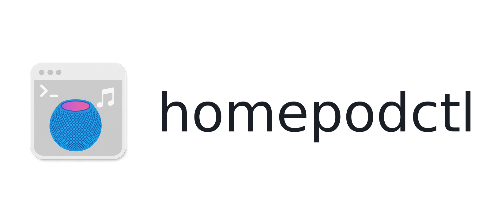

# homepodctl

<p align="center">
  
</p>

<p align="center">
  <a href="https://github.com/agisilaos/homepodctl/releases">
    
  </a>
  
  
</p>

macOS CLI that controls Apple Music playback and routes audio to HomePods.

## Requirements

- macOS with the Music app
- `osascript` (built-in)
- `shortcuts` (built-in, optional for the `native` backend)
- Go toolchain to build (if building from source)

## Permissions

On first use, macOS may prompt you to allow your terminal (or the built binary) to control:

- Music (via Apple Events)
- Shortcuts (if you use the `native` backend)

## Two playback backends

- `--backend airplay`: selects Music.app AirPlay output device(s) and plays a playlist (the Mac is the sender).
- `--backend native`: runs a Shortcuts automation you map in `config.json` (can be set up so HomePod plays natively).

## Mental model (important)

- **“Rooms” = AirPlay device names** as seen by Music.app (HomePods, Apple TVs, speakers, etc).
- `out set` changes **Music.app’s current AirPlay outputs** (it does not edit your config).
- `play` plays a **Music.app user playlist** (by fuzzy search or by ID).
- `config.json` is only for **defaults and aliases** (so you don’t have to type `--room` every time).

## Quick start (AirPlay)

List available AirPlay outputs (these names are what you pass as “rooms”):

```sh
homepodctl devices
```

Pick outputs to play through (sets Music.app’s current outputs):

```sh
homepodctl out set "Bedroom"
```

Play a playlist by fuzzy query:

```sh
homepodctl play chill
```

If the playlist name has spaces, quote it:

```sh
homepodctl play "Songs I've been obsessed recently pt. 2"
```

If multiple playlists match, auto-picks the best match; to pick interactively:

```sh
homepodctl play autumn --choose
```

See status (playback + outputs/route + backend connectivity/auth):

```sh
homepodctl status
```

Shortcut for `status`:

```sh
homepodctl now
```

Watch changes:

```sh
homepodctl status --watch 1s
```

Search playlists (for IDs / debugging):

```sh
homepodctl playlists --query chill
```

If a playlist name is ambiguous or tricky to match (emoji/whitespace), use IDs:

```sh
homepodctl playlists --query autumn
homepodctl play --playlist-id <PERSISTENT_ID>
```

Set volume (if rooms are omitted, uses `defaults.rooms`; if that’s empty, uses the currently selected outputs in Music.app):

```sh
homepodctl vol 50
homepodctl volume 35 "Living Room"
```

## Config (defaults + aliases)

Create a starter config:

```sh
homepodctl config-init
```

This writes `config.json` under your macOS user config dir (typically `~/Library/Application Support/homepodctl/config.json`).

Defaults are used when flags are omitted. For example, if you set:

- `defaults.backend = "airplay"`
- `defaults.rooms = ["Bedroom"]`

…then you can just run:

```sh
homepodctl play chill
```

List configured aliases:

```sh
homepodctl aliases
```

Run an alias from your config:

```sh
homepodctl run bed-example
```

## Native backend (optional)

Edit `config.json`, map `room -> playlist -> shortcut name`, and run:

```sh
homepodctl play --backend native --room "Bedroom" --playlist "Example Playlist"
```

## Help

CLI help:

```sh
homepodctl --help
homepodctl --verbose status
homepodctl help play
```

Verbose diagnostics can also be enabled via `HOMEPODCTL_VERBOSE=1`.

Run built-in diagnostics:

```sh
homepodctl doctor
homepodctl doctor --json
```

Generate shell completions:

```sh
homepodctl completion zsh
homepodctl completion bash
homepodctl completion fish
```

Install shell completions:

```sh
# auto-target default path for shell
homepodctl completion install zsh
homepodctl completion install bash
homepodctl completion install fish
```

Manual load snippets:

```sh
# zsh (~/.zshrc)
fpath=(~/.zsh/completions $fpath)
autoload -Uz compinit && compinit

# bash (~/.bashrc)
source ~/.local/share/bash-completion/completions/homepodctl

# fish
# file is auto-loaded from ~/.config/fish/completions/homepodctl.fish
```

Inspect and update config values:

```sh
homepodctl config validate --json
homepodctl config get defaults.backend
homepodctl config set defaults.backend airplay
homepodctl config set defaults.rooms "Bedroom" "Living Room"
```

Dry-run mutating commands without side effects:

```sh
homepodctl play chill --dry-run --json
homepodctl out set "Bedroom" --dry-run --json
homepodctl volume 30 --dry-run --json
homepodctl run bed --dry-run --json
```

## Exit codes

- `0`: success
- `2`: usage/flag/validation error
- `3`: config or automation validation error
- `4`: backend command error (`osascript` / `shortcuts`)
- `1`: other runtime failures

## Command cheat sheet

- `homepodctl devices` / `homepodctl out list`: list AirPlay devices
- `homepodctl out set <room> ... [--json|--plain|--dry-run]`: select Music.app outputs
- `homepodctl play <query> [--json|--plain|--dry-run]` / `homepodctl play --playlist-id <id>`: play a playlist
- `homepodctl playlists --query <text> [--json|--plain]`: search playlists
- `homepodctl status [--json|--plain]` / `homepodctl now` / `homepodctl status --watch 1s`: playback, route, and connectivity status
- `homepodctl pause|stop|next|prev [--json|--plain]`: transport controls
- `homepodctl volume <0-100> [room ...] [--json|--plain|--dry-run]` / `homepodctl vol ...`: output volume
- `homepodctl aliases [--json|--plain]` / `homepodctl run <alias> [--json|--plain|--dry-run]`: config shortcuts
- `homepodctl native-run --shortcut <name> [--json|--dry-run]`: run a Shortcut directly
- `homepodctl config validate|get|set ...`: validate and edit config values (`defaults.*`)
- `homepodctl config-init`: create starter config
- `homepodctl doctor`: diagnostics checklist
- `homepodctl completion <bash|zsh|fish>`: generate completion script
- `homepodctl plan <command> ...`: preview resolved dry-run execution for core actions
- `homepodctl schema [<name>] [--json]`: inspect JSON output contracts
- `homepodctl automation validate|plan|run|init ...`: routine workflows (non-interactive by default; add `--dry-run` to preview)
- `homepodctl version`: version info

## Common gotchas

- **You built it but it still behaves “old”:** if you run `make build`, the binary is `./homepodctl`. Running `homepodctl ...` might be a different binary on your PATH.
- **Rooms are not flags:** use `--room "Bedroom"` (repeatable), not `--bedroom` / `--Bedroom`.
- **`out set` doesn’t edit config:** it only changes Music.app’s current outputs. Use `config-init` + edit `defaults.rooms` if you want persistent defaults.

## Automation (v1 design)

Automation commands are being designed for routine playback flows and agent usage.

Design docs:

- CLI spec: `docs/automation-v1-cli-spec.md`
- User quickstart: `docs/automation/quickstart-user.md`
- Agent quickstart: `docs/automation/quickstart-agent.md`
- Troubleshooting matrix: `docs/automation/troubleshooting.md`
- Preset templates: `docs/automation/presets/`

Canonical presets included:

- `docs/automation/presets/morning.yaml`
- `docs/automation/presets/focus.yaml`
- `docs/automation/presets/winddown.yaml`
- `docs/automation/presets/party.yaml`
- `docs/automation/presets/reset.yaml`

## Distribution

This tool is macOS-only (it relies on `osascript` + Music.app, and optionally `shortcuts`).

- **Homebrew (recommended):**
  - `brew tap agisilaos/tap`
  - `brew install homepodctl`
- **From source (recommended while iterating):** `make build`
- **Release preflight (recommended):** `make release-check VERSION=vX.Y.Z` validates changelog/test/vet/docs and produces a version-stamped local binary.
- **Release dry run:** `make release-dry-run VERSION=vX.Y.Z` builds release artifacts only (no changelog/tag/push/release/tap writes).
- **Prebuilt binaries:** `make release VERSION=vX.Y.Z` publishes a GitHub Release and updates the Homebrew formula in `agisilaos/homebrew-tap`.
- **Release scripts:** `scripts/release-check.sh` and `scripts/release.sh`
- **`go install` (after publishing):** `go install github.com/agisilaos/homepodctl/cmd/homepodctl@latest`

## Disclaimer

This project is not affiliated with Apple.
